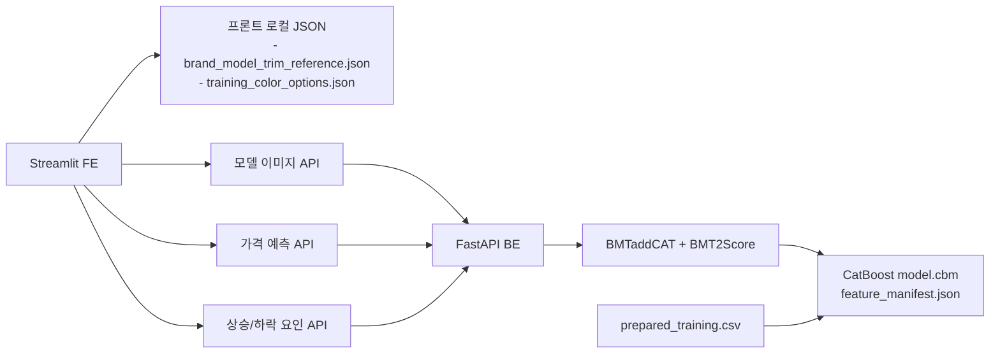

# SKN28 중고차 가격 예측 플랫폼

중고차의 현재 예측가와 향후 감가 흐름을 함께 보여주는 모노레포 프로젝트입니다.  
현재 MVP 기준으로는 다음 세 축이 실제로 연결되어 있습니다.

- `fe/`: Streamlit 기반 사용자 입력/결과 화면
- `be/`: FastAPI 기반 가격 예측, 요인 분석, 모델 이미지 API
- `predict_engine_research/`: CatBoost 학습 워크스페이스와 모델 산출물

`data_collection/` 과 `data_insert/` 는 학습 데이터 생성과 보조 자산 정리에 사용합니다.

## 저장소 구조

```text
SKN28-1st-4team/
├─ README.md
├─ pyproject.toml
├─ uv.lock
├─ docker-compose.yml
├─ fe/
├─ be/
├─ predict_engine_research/
├─ predict_engine_host/
├─ data_collection/
├─ data_insert/
└─ docs/
```

## 현재 동작 구조



핵심 포인트는 아래와 같습니다.

- 브랜드/모델/세부 트림 선택 데이터는 프런트가 로컬 JSON으로 직접 가집니다.
- 모델 카드 이미지는 백엔드 `model-images` API를 호출합니다.
- 가격 예측과 상승/하락 요인도 백엔드 API를 호출합니다.
- 백엔드는 내부 `predict_engine` 패키지와 `model.cbm` 을 직접 사용합니다.
- `predict_engine_host/` 는 별도 서빙 실험용 디렉토리로 남아 있지만, 현재 프런트 MVP 플로우의 필수 경로는 아닙니다.

## 워크스페이스

루트는 `uv` workspace 입니다.

현재 멤버:

- `fe`
- `be`
- `predict_engine_research`
- `predict_engine_host`
- `data_collection`

전체 의존성 동기화:

```bash
uv sync --all-packages
```

## 로컬 실행

### 1. 백엔드 실행

```bash
cd be
uv run --env-file .env uvicorn --app-dir src app:app --reload --host 0.0.0.0 --port 8000
```

### 2. 프런트 실행

```bash
cd fe
uv run --env-file .env streamlit run src/app.py
```

기본 주소:

- 프런트: `http://localhost:8501`
- 백엔드: `http://127.0.0.1:8000`

## Docker Compose

```bash
docker compose up --build
```

현재 compose에는 아래 서비스가 정의돼 있습니다.

- `fe`
- `be`
- `predict-engine-host`

주의:

- 프런트 컨테이너에서 백엔드를 호출할 때는 `FE_QUERY_BASE_URL=http://be:8000` 이어야 합니다.
- 로컬에서 직접 실행할 때는 `FE_QUERY_BASE_URL=http://127.0.0.1:8000` 이 맞습니다.

## 프런트/백엔드 계약

현재 프런트가 백엔드로 호출하는 주요 API는 아래 세 개입니다.

- `POST /api/v1/frontend/model-images`
- `POST /api/v1/frontend/price-prediction`
- `POST /api/v1/frontend/price-factors`

반대로 아래 데이터는 프런트 로컬 자산을 사용합니다.

- 브랜드/모델/세부 트림 참조: `fe/src/assets/brand_model_trim_reference.json`
- 색상 옵션 참조: `fe/src/assets/training_color_options.json`

## 모델 학습과 배포 자산

학습 워크스페이스는 `predict_engine_research/` 입니다.

주요 입력/출력:

- 학습 입력: `predict_engine_research/data/prepared_training.csv`
- 학습 노트북: `predict_engine_research/src/main.ipynb`
- 산출물:
  - `predict_engine_research/output/model.cbm`
  - `predict_engine_research/output/feature_manifest.json`
  - `predict_engine_research/output/metrics.json`

현재 배포용 자산은 백엔드에 동기화해 두고 사용합니다.

- `be/src/external/predict_engine/model_assets/model.cbm`
- `be/src/external/predict_engine/model_assets/feature_manifest.json`
- `be/src/external/predict_engine/model_assets/metrics.json`

현재 모델 feature 는 아래 8개입니다.

- `brand`
- `model_name`
- `trim_name`
- `major_category`
- `size_score`
- `vehicle_age_years`
- `color`
- `mileage_km`

## 데이터 준비 흐름

학습 데이터 준비는 크게 두 단계입니다.

1. `data_collection/clean/`
   - 원본 상세 페이지 JSON 정리
   - sanitize / training-ready / clean notebook 수행
2. `predict_engine_research/data/`
   - 최종 `prepared_training.csv` 사용

대표 산출물:

- `data_collection/clean/output/detail_pages_sanitized.csv`
- `data_collection/clean/output/detail_pages_training_ready.csv`
- `data_collection/clean/output/prepared_training_1.csv`

## 문서 가이드

세부 설명은 각 하위 디렉토리 README를 참고하면 됩니다.

- [fe/README.md](/Users/iwonbin/workspace/Study/boot/SKN28-1st-4team/fe/README.md)
- [be/README.md](/Users/iwonbin/workspace/Study/boot/SKN28-1st-4team/be/README.md)
- [predict_engine_research/README.md](/Users/iwonbin/workspace/Study/boot/SKN28-1st-4team/predict_engine_research/README.md)
- [data_collection/raw/models_cohort/README.md](/Users/iwonbin/workspace/Study/boot/SKN28-1st-4team/data_collection/raw/models_cohort/README.md)

## 현재 주의사항

- `.env` 실파일은 Git에 올리지 않습니다.
- W&B 로그, 로컬 스크린샷, 임시 산출물은 커밋 대상이 아닙니다.
- 프런트의 차량 선택 데이터는 백엔드가 아니라 로컬 JSON 기준입니다.
- 모델 이미지가 DB에 없더라도, 백엔드는 로컬 `data_insert/source/images` 를 fallback 으로 사용합니다.
