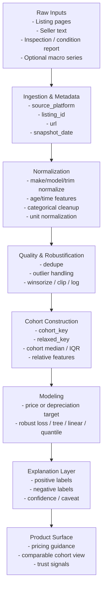
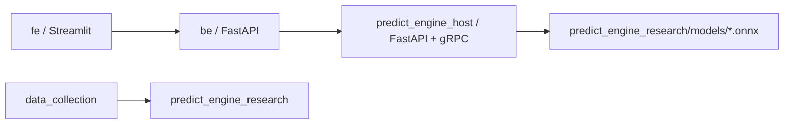

# SKN28 중고차 가격·감가 예측 플랫폼

> 진행 중인 프로젝트입니다. 현재 저장소 구조, 모델 파이프라인, 문서, 실험 추적 방식은 계속 보강되고 있으며 일부 서비스와 문서는 MVP 기준으로 정리되어 있습니다.

## 1. 정당화

이 프로젝트는 단순히 "지금 이 차가 얼마인가"를 보여주는 중고차 시세 조회 도구가 아니다. 우리가 풀고 싶은 문제는 **사용자가 언제 팔아야 더 좋은 의사결정을 할 수 있는지**, 그리고 **왜 지금 가격이 높거나 낮은지**까지 설명하는 것이다.

기존 중고차 서비스의 한계는 대체로 다음과 같다.

- 현재 시세를 평면적으로 보여주지만, 향후 급격한 감가 구간을 설명하지 못한다.
- 동일 차량 단위 식별(VIN, 세대 구분, 중복 매물 정리)이 불완전할 때 예측 근거가 약해진다.
- 사고, 소유 이력, 정비 이력, 옵션, 과주행 여부 같은 리스크 요인이 가격에 어떻게 반영되는지 사용자 언어로 풀어주지 못한다.
- 매물가(listing price)와 실거래가(transaction price)의 차이, 재등록/중복 매물, 계절성, 시장 노이즈를 충분히 다루지 못한다.

이 저장소의 멘탈 모델은 다음과 같다.

1. **현재 적정가**를 맞춘다.
2. **감가 리스크**를 함께 본다.
3. **왜 그런 판단이 나왔는지** 설명한다.

즉, 제품의 핵심은 "현재 가격 조회"가 아니라 **의사결정을 돕는 가격·감가 예측 시스템**이다. 사용자는 단순 시세가 아니라, 지금 팔아야 하는지 / 더 보유해도 되는지 / 어떤 요인이 손해를 키우는지를 알고 싶다.

## 2. 전술

### 2.1 기술 프레임워크

이 저장소는 모노레포 구조이며, 루트의 `docker-compose.yml` 이 각 서비스의 Dockerfile을 묶는 메인 진입점이다.

| 영역 | 프레임워크 / 도구 | 역할 |
| --- | --- | --- |
| 모노레포 / 패키지 관리 | `uv` workspace | 루트 워크스페이스 의존성 관리, 서비스별 실행 |
| 프런트엔드 | `Streamlit` | 가격/상태/설명 결과를 보여주는 UI |
| 백엔드 API | `FastAPI`, `Pydantic Settings`, `PyMySQL`, `Loguru` | 서비스 API, 환경변수 로딩, DB 연결, 로깅 |
| 모델 호스팅 | `FastAPI`, `gRPC`, `protobuf`, `ONNX`, `onnxruntime` | ONNX 모델 로드, 예측 요청 처리, 백엔드 연동 |
| 연구 / 학습 | `PyTorch`, `scikit-learn`, `pandas`, `numpy` | 실험, 학습, 피처 검증, 모델 산출 |
| 데이터 수집 | Python workspace package | 원천 데이터 적재 및 정제 파이프라인의 시작점 |
| 인프라 | `Docker`, `Docker Compose` | `fe`, `be`, `predict_engine_host` 통합 실행 |

### 2.2 문제를 푸는 방식

이 프로젝트는 **코호트 기반(cohort-based) 가격·감가 예측**을 전제로 한다. 즉, VIN 매칭이나 세대 식별이 완전하지 않아도, "동급 묶음"을 먼저 정의하고 그 위에 상태/리스크 조정을 얹는 방식이다.

핵심 전략은 3단계다.

#### 1) 기본 가치(Base Value)

- 제조사, 모델, 트림, 파워트레인, 연식, 신차 기준가 같은 속성으로 기본 가격대를 잡는다.
- 헤도닉 가격 이론 관점에서 차량은 "속성 묶음"으로 거래되므로, 이 층은 가격의 출발점이다.

#### 2) 리스크 조정(Risk Adjustment)

- 사고 이력, 구조 손상, 침수, 소유자 수, 렌트/영업 이력, 정비 이력, 옵션 등을 반영한다.
- 이는 중고차 시장의 정보 비대칭을 줄이거나 키우는 요인이며, 실제 가격 프리미엄/패널티로 이어진다.

#### 3) 강건화(Robustification)

- 로그 변환, 윈저라이즈/트리밍, 코호트 상대화, 계절성/시장효과 분리로 노이즈를 줄인다.
- 매물가와 실거래가의 차이, 중복 등록, 급매/허위 매물, 시기별 시장 충격을 그대로 학습하지 않도록 설계한다.

여기에 제품 관점의 **설명 레이어(Explanation Layer)** 를 별도로 둔다. 즉, 모델 성능만이 아니라 사용자가 이해 가능한 언어로 "왜 비싸고 왜 싼지"를 보여준다.

### 2.3 제품 관점의 핵심 질문

| 질문 | 기존 시세 서비스 | 이 프로젝트 |
| --- | --- | --- |
| 지금 얼마인가? | 보여줌 | 보여줌 |
| 왜 이 가격인가? | 제한적 | 사고/주행/소유/정비/옵션 기준으로 설명 |
| 앞으로 언제 크게 떨어질 수 있는가? | 거의 제공 안 함 | 감가 리스크와 시간 요인을 분리해 해석 |
| 동급 대비 비싸거나 싼가? | 비교 제한적 | 코호트 상대 지표로 설명 |
| 데이터가 지저분해도 견딜 수 있는가? | 취약 | 로그/윈저라이즈/중복 제거/계절 조정 적용 |

### 2.4 데이터 파이프라인



기술적인 상세 설계, 왜 이런 구조를 택했는지에 대한 배경, 실험 리포트 연결 방식은 `docs/index.md` 와 GitHub Pages 문서에서 확장해 관리한다.

### 2.5 시장 노이즈와 시계열 처리

| 방법 | 목적 | 초기 권장값 / 메모 |
| --- | --- | --- |
| `log(price)` / `log(price_to_new_ratio)` | heavy-tail 완화, 선형성 개선 | 가격 타깃의 기본 후보 |
| 윈저라이즈 / 트리밍 | 급매, 허위 입력, 비정상 이상치 완화 | `p1-p99` 또는 `p0.5-p99.5` |
| 코호트 중앙값 / IQR 기준선 | 동일 차량 식별이 불완전해도 동급 정상 범위 확보 | 코호트 표본 `n < 30` 이면 상위 코호트 shrinkage |
| 이동 중앙값 / LOESS | 톱니형 가격 곡선 완화 | LOESS span `0.2-0.4` |
| 월 고정효과 / 외부 지표 | 시장 국면 분리 | `snapshot_date` 기준 월 단위 정렬 |
| 강건 손실 | 이상치에 덜 흔들리는 학습 | Huber, Quantile 회귀 후보 |
| 계층모형 / 랜덤효과 | 소표본 코호트 안정화 | `make/model/trim` 단위 partial pooling |

### 2.6 설명 레이어에서 보여줄 문장 예시

- 가격 방어 요인: `무사고`, `동급 대비 저주행`, `최근 정비`, `선호 옵션`, `1인 소유`
- 가격 하락 요인: `구조/침수 이력`, `동급 대비 과주행`, `렌트/영업 이력`, `소유자 변경 많음`, `정비 이력 부족`
- 사용자에게는 "예측값"보다 "왜 이런 값이 나왔는가"가 더 중요할 수 있다.

### 2.7 근거 문헌 및 실무 참고자료

- Rosen (1974), *Hedonic Prices and Implicit Markets*: 자동차 가격을 속성 묶음으로 보는 이론적 기반.
- Akerlof (1970), *The Market for “Lemons”*: 중고차 시장의 정보 비대칭 문제를 설명.
- 송정석·신준호·이동준 (2020): 연식, 주행거리, 지역 요인이 중고차 가격 결정에 중요함을 실증.
- Sharma et al. (2024): 차령, 주행거리, 소유자 수의 비선형 영향과 MARS 접근 제시.
- Huang, Liu, Luo (2021): VHR(차량 이력 보고서)가 판매 효율과 품질 매칭에 가치를 가진다는 근거.
- CARFAX (2025): 사고 이력의 평균 가격 패널티와 심각 사고의 추가 할인 사례.
- 국토교통부 성능·상태점검기록부 서식: 구조손상/외판수리 구분의 공식 기준.
- 보험연구원(KIRI, 2024): 점검기록부, 책임보험, 보증 구조의 한계와 품질관리 필요성.
- Englmaier et al. (2018): 등록연도/주행거리 구간 경계에서 가격 불연속이 발생함을 실증.
- Manheim Used Vehicle Value Index 방법론: 이상치 제거, 주행거리 보정, 계절조정의 업계 표준 사례.
- J.D. Power ALG Residual Value 자료: 잔존가치에 영향을 주는 상태/옵션/공급/계절성 요인 정리.
- Busse et al. (2009): 유가 충격이 중고차 상대가격을 바꿀 수 있다는 시장 외생변수 근거.
- NIST Engineering Statistics Handbook: 윈저라이즈/트리밍 등 강건 통계의 실무 근거.
- Tversky & Kahneman (1974), Schweinsberg et al. (2023): 앵커링과 협상 효과가 가격 해석에 미치는 영향.

## 3. 저장소 설명

### 3.1 모노레포 구조

```text
SKN28-1st-4team/
├─ README.md
├─ pyproject.toml                # uv workspace 루트
├─ docker-compose.yml            # 메인 compose 진입점
├─ proto/                        # gRPC / protobuf 계약
├─ fe/                           # Streamlit 프런트엔드
├─ be/                           # FastAPI 백엔드 API
├─ predict_engine_host/          # ONNX + gRPC 모델 호스팅
├─ predict_engine_research/      # 학습/실험/모델 산출물 저장 공간
└─ data_collection/              # 데이터 수집/정제 시작점
```

### 3.2 각 디렉토리 역할

- `fe/`: UI 레이어. 현재는 실행 환경과 기본 화면을 보여주는 Streamlit 앱이다.
- `be/`: API 레이어. `/health`, `/predict-engine/health`, `/predict-engine/predict` 를 제공한다.
- `predict_engine_host/`: ONNX 모델을 로드하고 HTTP health + gRPC prediction 서버를 함께 띄운다.
- `predict_engine_research/`: 학습 실험 공간. 내보낸 ONNX 모델을 `models/` 아래에 두는 흐름을 상정한다.
- `data_collection/`: 원천 데이터 적재 및 정제 파이프라인의 출발점이다.
- `proto/`: 백엔드와 모델 호스팅 간 gRPC 계약(`predict_engine.proto`)을 관리한다.

### 3.3 현재 서비스 흐름



## 4. 실행 방법

### 4.1 사전 준비

- Python `3.14` 권장 (`predict_engine_research` 가 `>=3.14` 요구)
- `uv` 설치
- Docker / Docker Compose 설치
- 백엔드가 붙을 MySQL 또는 MariaDB 접속 정보 준비
- ONNX 모델 파일 준비 (권장 경로: `predict_engine_research/models/model.onnx`)

### 4.2 환경변수 파일 준비

실제 `.env` 파일은 Git에 포함하지 않는다. 루트 `.gitignore` 에 `.env` 와 `*/.env` 가 이미 제외되어 있으므로, 샘플 파일을 복사해 각 서비스별로 직접 채워 넣으면 된다.

- `be/` 는 기존 `be/.env.example` 도 유지하고 있으며, 온보딩 통일을 위해 `be/.env.sample` 도 함께 제공한다.

```bash
cp be/.env.sample be/.env
cp fe/.env.example fe/.env
cp predict_engine_host/.env.sample predict_engine_host/.env
```

#### 백엔드 `be/.env`

- `DB_HOST`, `DB_PORT`, `DB_USER`, `DB_PASSWORD`, `DB_NAME` 을 실제 DB 정보로 바꿔야 한다.
- Docker Compose 에서는 `PREDICT_ENGINE_GRPC_HOST` 가 `predict-engine-host` 로 override 되므로, 샘플 기본값은 로컬 실행 기준으로 봐도 된다.

#### 모델 호스팅 `predict_engine_host/.env`

- `MODEL_PATH` 는 기본적으로 `./models/model.onnx` 를 가리킨다.
- 루트 Compose 실행 시 `./predict_engine_research/models` 가 컨테이너의 `/app/models` 에 mount 되므로, 파일 위치만 맞으면 된다.

#### 프런트엔드 `fe/.env`

- 현재는 Streamlit 서버 설정 위주다.
- 추후 백엔드 URL, 설명 API, 비교군 API 등을 여기에 확장할 수 있다.

### 4.3 루트 워크스페이스 동기화

루트에서 한 번에 의존성을 동기화할 수 있다.

```bash
uv sync --all-packages
```

### 4.4 가장 쉬운 실행: 루트 Docker Compose 사용

이 저장소는 모노레포지만, 실제 통합 실행은 **루트의 `docker-compose.yml`** 을 사용한다.

```bash
docker compose up --build
```

필요하면 백그라운드 실행:

```bash
docker compose up -d --build
```

이 명령은 다음을 함께 띄운다.

- `fe` -> `http://localhost:8501`
- `be` -> `http://localhost:8000`
- `predict_engine_host` -> `http://localhost:8001`

주의:

- 루트 Compose에는 DB 컨테이너가 없다. 따라서 `be/.env` 의 DB 연결 정보를 실제 외부 DB 또는 별도 테스트 DB로 맞춰야 한다.
- ONNX 파일이 없으면 `predict_engine_host` 는 뜨더라도 모델 상태가 `degraded` 로 보일 수 있다.

### 4.5 서비스별 로컬 실행

#### 프런트엔드

```bash
cd fe
uv run --env-file .env streamlit run src/app.py
```

#### 백엔드

```bash
cd be
uv run --env-file .env uvicorn --app-dir src app:app --reload --host 0.0.0.0 --port 8000
```

#### 모델 호스팅

```bash
cd predict_engine_host
uv run --env-file .env uvicorn --app-dir src app:app --reload --host 0.0.0.0 --port 8001
```

#### 데이터 수집 워크스페이스

```bash
cd data_collection
uv run python src/main.py
```

### 4.6 빠른 확인 방법

#### Health check

```bash
curl http://127.0.0.1:8000/health
curl http://127.0.0.1:8001/health
```

#### 예측 요청 예시

아래 요청은 **모델 파일이 존재하고**, **feature 수가 모델 입력과 맞아야** 정상 동작한다.

```bash
curl -X POST http://127.0.0.1:8000/predict-engine/predict \
  -H "Content-Type: application/json" \
  -d '{
    "request_id": "demo-1",
    "feature_names": ["vehicle_age_months", "odometer_km", "owner_count"],
    "records": [
      {
        "vehicle_age_months": 36,
        "odometer_km": 42000,
        "owner_count": 1
      }
    ]
  }'
```

### 4.7 외부 DB가 없을 때의 개발 옵션

백엔드 통합 테스트용 DB compose override 가 이미 있다. 빠르게 DB 연결만 확인하고 싶다면 아래 조합을 쓸 수 있다.

```bash
docker compose -f docker-compose.yml -f be/tests/integration/external/db/docker-compose.yml up -d --build test_db_docker
```

그 다음 백엔드 테스트 실행:

```bash
cd be
RUN_DOCKER_DB_TESTS=1 TEST_DB_HOST=127.0.0.1 TEST_DB_PORT=3307 uv run pytest tests/integration/external/db/test_client_connection.py
```

## 5. 현재 상태와 다음 단계

현재 이 저장소는 아래와 같은 단계에 있다.

- 모노레포 워크스페이스와 서비스 골격은 준비되어 있다.
- 백엔드와 모델 호스팅 간 gRPC 계약이 `proto/` 기준으로 정리되어 있다.
- 프런트엔드, 백엔드, 모델 호스팅을 루트 Compose로 함께 띄울 수 있다.
- GitHub Pages용 기술 문서 초안은 `docs/index.md` 를 중심으로 확장 중이다.
- 데이터 수집과 학습 공간은 마련되어 있지만, 실제 수집기/학습 파이프라인은 확장 중이다.

다음으로 자연스럽게 이어질 일은 다음과 같다.

1. `fe` 에 가격 설명/감가 리스크 UI 추가
2. `predict_engine_research` 에 학습 엔트리포인트와 ONNX export 스크립트 추가
3. W&B public report 를 `docs/experiments.md` 와 GitHub Pages에 연결
4. 런타임 서비스 전체(`fe`, `be`, `predict_engine_host`)의 `.env.sample` 템플릿 운용 체계 고도화
