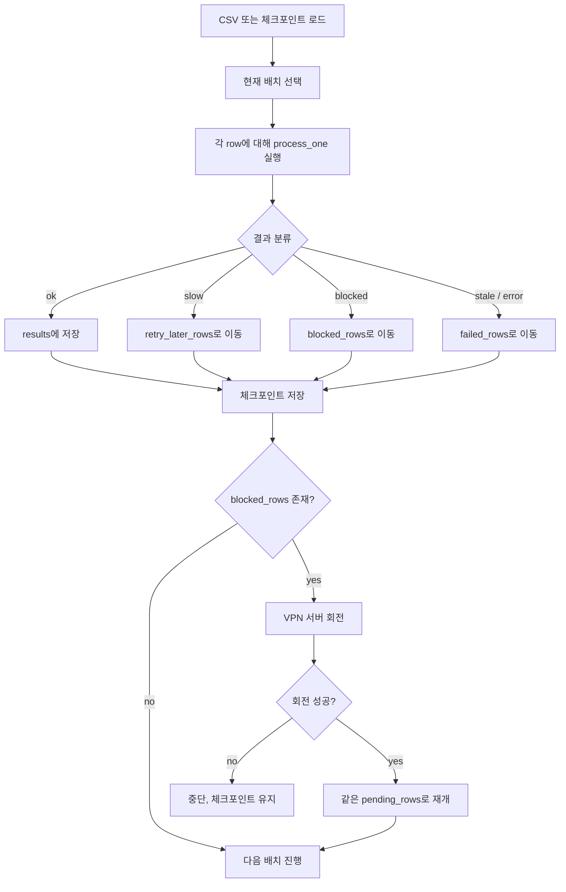
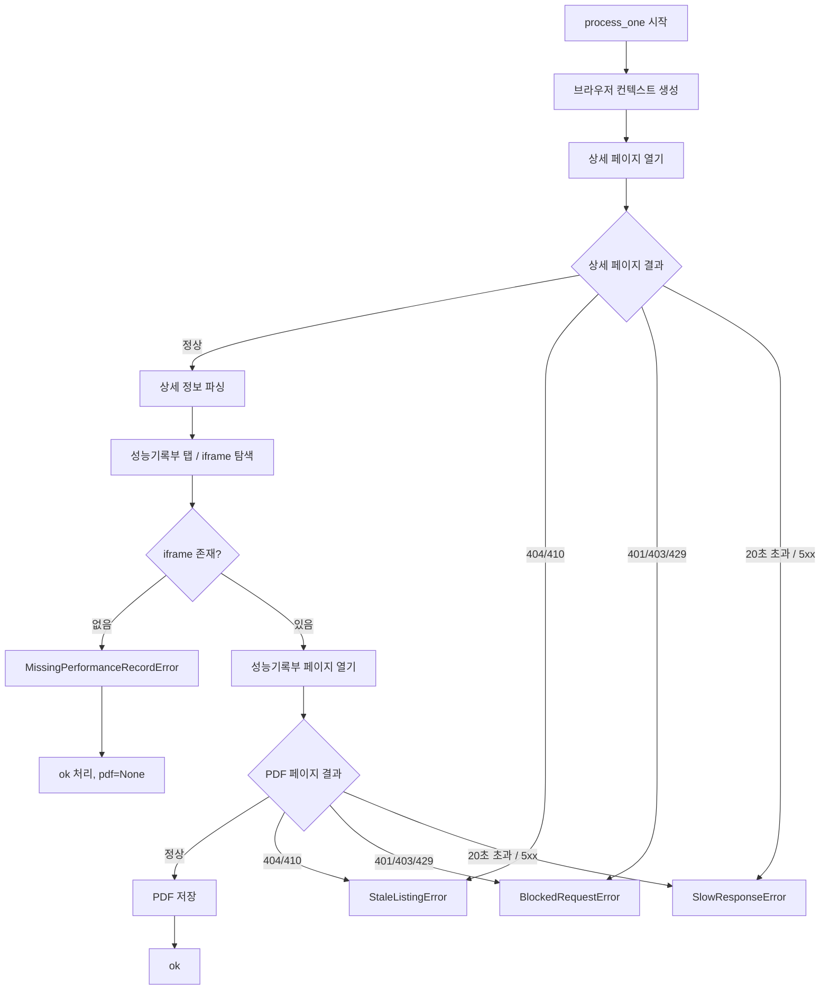
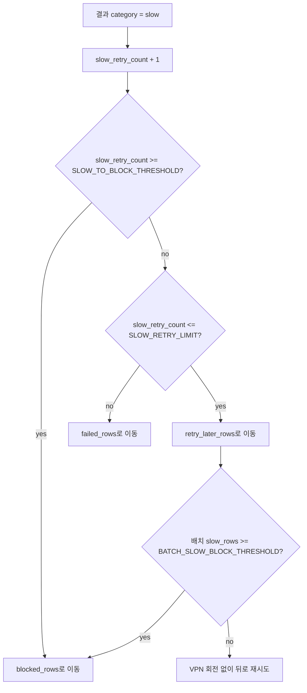

# 데이터 수집 크롤링 가이드

이 문서는 `data_collection/src` 기준으로 현재 크롤링이 실제로 어떻게 동작하는지 설명합니다.

대상은 카쿠 상세 페이지와 성능기록부 PDF이며, 핵심 목표는 다음 두 가지입니다.

1. 상세 페이지의 기본 차량 정보를 안정적으로 추출한다.
2. 성능기록부 PDF를 저장하되, 느린 응답 / 차단 / 오래된 링크를 구분해서 처리한다.

## 1. 현재 구조

주요 파일:

- `main.ipynb`
  - 실제 배치 크롤링 오케스트레이션
  - 체크포인트 저장 / 재개
  - 오류 분류
  - 느린 응답 재시도
  - VPN 회전
- `loader/crawl/detail_page.py`
  - 상세 페이지의 기본 차량 정보 추출
- `loader/crawl/performance_record.py`
  - 상세 페이지 안의 성능기록부 iframe을 찾아 PDF 저장
- `loader/crawl/browser.py`
  - Playwright 브라우저 컨텍스트 생성
- `loader/crawl/errors.py`
  - 크롤링 전용 예외 타입 정의
- `scripts/vpn_switcher.py`
  - NordVPN CLI 기반 서버 전환 / 상태 확인 / IP 확인 / 프로브 확인

## 2. 현재 실행 파라미터

`main.ipynb`의 현재 기준값은 다음과 같습니다.

- `MAX_ITEMS = 10`
  - 현재는 테스트용으로 앞 10개만 읽도록 되어 있음
  - 실제 대량 실행 전에는 값 조정 필요
- `BATCH_SIZE = 3`
- `DETAIL_CONCURRENCY = 3`
- `PDF_CONCURRENCY = 2`
- `DETAIL_TIMEOUT_MS = 20_000`
- `PDF_TIMEOUT_MS = 20_000`
- `PDF_RETRY_COUNT = 1`
- `SLOW_RETRY_LIMIT = 2`
- `SLOW_TO_BLOCK_THRESHOLD = 3`
- `BATCH_SLOW_BLOCK_THRESHOLD = 2`

의미:

- 상세 페이지 / PDF 응답이 20초를 넘기면 느린 응답으로 간주합니다.
- 느린 응답은 바로 VPN을 바꾸지 않고 우선 뒤로 미룹니다.
- 하지만 같은 배치에서 느린 응답이 여러 건 모이거나, 같은 URL이 반복적으로 느리면 차단 의심으로 승격합니다.

## 3. 전체 크롤링 흐름



## 4. 상세 페이지와 PDF 처리 흐름

현재 `process_one()`은 row 하나를 처리할 때 브라우저 컨텍스트를 한 번 열고, 그 안에서 상세 페이지와 PDF 다운로드를 함께 수행합니다.

이전 대비 달라진 점:

- 브라우저를 상세 / PDF 단계마다 새로 띄우지 않음
- row 단위로 브라우저 컨텍스트를 재사용
- PDF는 `networkidle` 대신 실제 필요한 셀렉터만 기다림
- 느린 응답은 VPN 회전 사유와 분리해서 판단



## 5. 오류 분류 기준

현재는 문자열 매칭과 HTTP 응답 상태, 그리고 전용 예외 타입을 같이 사용합니다.

### 5-1. `BlockedRequestError`

의미:

- IP가 뜨거워졌거나
- 연결 상태가 불안정하거나
- 차단 / 제한 응답으로 볼 수 있는 상태

주요 조건:

- HTTP `401`, `403`, `429`
- Playwright 네트워크 오류 문자열
  - `ERR_CONNECTION_CLOSED`
  - `ERR_CONNECTION_RESET`
  - `ERR_NETWORK_CHANGED`
  - `ERR_HTTP2_PROTOCOL_ERROR`

처리:

- `blocked_rows`로 이동
- 체크포인트 저장
- VPN 회전

### 5-2. `SlowResponseError`

의미:

- 서버가 너무 느리게 응답함
- 즉시 VPN 회전하기보다 soft-ban / cooldown / 서버 지연 가능성을 먼저 봄

주요 조건:

- 상세 페이지 timeout 20초 초과
- PDF 페이지 timeout 20초 초과
- HTTP `5xx`

처리:

- 1차: 뒤로 미뤄서 재시도
- 반복되면 차단 의심으로 승격

현재 승격 규칙:

- 같은 URL이 느린 응답을 `3회` 만나면 `blocked`로 승격
- 같은 배치에서 느린 응답 row가 `2건` 이상이면 배치 차원에서 `blocked`로 승격

### 5-3. `StaleListingError`

의미:

- 링크 자체가 오래되었거나
- 상세 페이지가 더 이상 유효하지 않음

주요 조건:

- HTTP `404`, `410`

처리:

- `failed_rows`로 이동
- VPN 회전하지 않음

### 5-4. `MissingPerformanceRecordError`

의미:

- 상세 페이지는 정상인데 성능기록부 iframe이 없음

처리:

- row 전체를 실패로 보지 않음
- 상세 정보는 `ok`
- PDF만 `None`

## 6. 느린 응답 재시도 / 차단 승격 흐름



핵심:

- 느린 응답 1건은 바로 VPN 회전하지 않습니다.
- 하지만 느린 응답이 누적되면 차단 의심으로 간주합니다.

## 7. VPN 회전 정책

현재 `main.ipynb`는 한국 서버를 1순위, 일본 서버를 2순위로 둡니다.

1순위:

- `kr115`
- `kr142`
- `kr106`
- `kr117`
- `kr153`
- `kr94`
- `kr120`

2순위:

- `jp789`
- `jp515`
- `jp429`
- `jp706`
- `jp765`
- `jp570`
- `jp589`
- `jp584`

정책:

- 차단 의심 시 한국 서버부터 시도
- 한국 서버가 모두 실패하면 일본 서버로 이동
- 일본 서버가 성공하면 다음 차단 시도 때는 다시 한국 우선
- 일본 fallback 인덱스는 유지해서 같은 일본 서버만 반복하지 않도록 함

또한 `scripts/vpn_switcher.py`는 다음 조건을 만족해야 “전환 성공”으로 봅니다.

- `nordvpn status`가 Connected
- 목표 서버 alias와 일치
- 이전에 사용한 IP 또는 hostname과 같지 않음
- `VPN_PROBE_URL` 프로브 성공
- 프로브 지연이 허용치 이내

## 8. 로그 해석

배치 실행 중 대표 로그:

```text
[시도 4] 완료 - 차량번호: 28다3785 / PDF: ... / 소요: 7.31초 / 오류: None
```

의미:

- 현재까지 4번째 시도 완료
- 차량번호
- PDF 저장 경로
- 한 row 처리 시간
- 오류 메시지

느린 응답 승격 로그:

```text
느린 응답이 배치에서 2건 발생하여 차단 의심으로 승격합니다.
```

의미:

- 이번 배치에서 timeout류가 몰렸으므로 soft-ban 가능성이 높다고 판단
- VPN 회전으로 넘어감

VPN 회전 로그:

```text
차단 의심 오류 감지. 체크포인트 저장 후 VPN 자동 전환을 시도합니다.
```

의미:

- 현재 `blocked_rows`가 존재
- 체크포인트 저장 완료
- `rotate_vpn_and_update_state()` 호출

## 9. 함수 역할 설명

### `main.ipynb`

- `load_initial_targets()`
  - 체크포인트가 있으면 재개
  - 없으면 CSV에서 대상 row 로드
- `save_checkpoint()`
  - 현재 진행 상태 저장
- `is_blocked_error()`
  - 예외 문자열만 보고도 네트워크 차단류인지 판별
- `record_vpn_result()`
  - 최근 VPN 회전 결과를 `runtime_state`에 누적
- `build_vpn_target_sequence()`
  - 한국 우선 / 일본 fallback 순서 생성
- `rotate_vpn_and_update_state()`
  - VPN 회전 호출 후 런타임 상태 반영
- `process_one()`
  - row 1개에 대해 상세 페이지 + PDF 저장 수행
  - 결과를 `ok / slow / blocked / stale / error`로 분류

### `loader/crawl/browser.py`

- `create_browser_context()`
  - Playwright 브라우저와 컨텍스트를 생성하고 정리
  - row 단위 브라우저 재사용의 기반

### `loader/crawl/detail_page.py`

- `crawl_detail_page()`
  - 상세 페이지를 열고 차량 기본 정보를 추출
- `_load_detail_page_html()`
  - 실제 페이지 접근 및 HTML 확보
- `_raise_for_navigation_response()`
  - HTTP 상태 코드 기반으로 `blocked / slow / stale` 분기
- `_parse_detail_page_html()`
  - 렌더링된 HTML에서 기본 필드 파싱

### `loader/crawl/performance_record.py`

- `download_performance_record_pdf()`
  - 상세 페이지에서 성능기록부 iframe을 찾고 PDF 저장
- `_open_performance_record_tab()`
  - 성능기록부 탭 노출
- `_locate_performance_record_iframe()`
  - 가장 유력한 iframe 선택
- `_raise_for_navigation_response()`
  - PDF 페이지도 상태 코드 기반 분기

### `loader/crawl/errors.py`

- `BlockedRequestError`
  - VPN 회전 후보
- `SlowResponseError`
  - 우선 뒤로 미루는 후보
- `StaleListingError`
  - 오래된 링크
- `MissingPerformanceRecordError`
  - 상세 페이지는 정상이나 PDF iframe 부재

### `scripts/vpn_switcher.py`

- `get_vpn_status()`
  - `nordvpn status` 파싱
- `fetch_public_ip()`
  - 공인 IP 확인
- `probe_url()`
  - 대상 사이트 프로브
- `wait_for_connection_change()`
  - 새 서버 / 새 IP / 새 hostname 확보될 때까지 폴링
- `switch_to_target()`
  - 단일 목표 서버 전환
- `rotate_vpn_connection()`
  - 목표 서버 리스트를 순서대로 돌면서 성공한 첫 서버 선택

## 10. 현재 병목과 개선 이유

이번 구조 변경의 핵심 이유는 다음과 같습니다.

1. 느린 응답이 길게 누적되면 배치 전체 속도가 무너짐
2. 상세 / PDF 단계마다 브라우저를 새로 띄우면 오버헤드가 큼
3. 모든 timeout을 즉시 VPN 회전으로 처리하면 NordVPN 전환 비용이 커짐
4. 반대로 timeout을 모두 뒤로 미루기만 하면 soft-ban 상태에서 맴돌 수 있음

그래서 현재 구조는 다음 균형점을 목표로 합니다.

- 20초를 넘는 느린 응답은 빠르게 컷
- 1회성 느림은 재시도
- 반복되면 차단 의심으로 승격
- VPN은 명확한 차단 또는 누적된 soft-ban 신호일 때만 회전
- 처리량은 `3 / 2` 수준의 보수적 동시성으로 확보

## 11. 실제 대량 실행 전 권장

실제 장시간 실행 전에는 다음 순서를 권장합니다.

1. `main.ipynb`에서 `MAX_ITEMS`를 작은 값으로 먼저 검증
2. VPN 상태가 Connected인지 확인
3. 첫 몇 개 row의 로그를 보고
   - `slow`가 많은지
   - `blocked`가 바로 뜨는지
   - PDF가 실제로 저장되는지 확인
4. 그다음 `MAX_ITEMS`를 올려서 장기 실행

## 12. 주의사항

- 이 README는 현재 코드 상태를 설명합니다.
- 특히 `main.ipynb`는 실험 과정에서 파라미터가 자주 바뀔 수 있으므로, 실제 실행 전에는 상단 설정 셀을 다시 확인해야 합니다.
