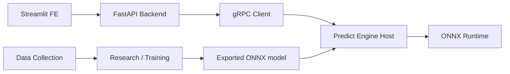

# 아키텍처

## 모노레포 구조

이 저장소는 `uv` workspace 기반 Python 모노레포다.

```text
SKN28-1st-4team/
├─ pyproject.toml
├─ docker-compose.yml
├─ proto/
├─ fe/
├─ be/
├─ predict_engine_host/
├─ predict_engine_research/
└─ data_collection/
```

## 서비스별 역할

### `fe/`

- Streamlit 기반 프런트엔드
- 가격/감가/설명 결과를 사용자에게 보여주는 화면 계층

### `be/`

- FastAPI 기반 백엔드
- DB 연결 상태 확인
- 모델 호스팅 계층으로 예측 요청 프록시
- 프런트엔드와 모델 서비스를 분리하는 API 경계 역할

### `predict_engine_host/`

- FastAPI + gRPC 기반 모델 호스팅 서비스
- ONNX 모델 로드
- 예측 요청 실행
- 모델 health 정보 제공

### `predict_engine_research/`

- 학습/실험/모델 산출 공간
- PyTorch, scikit-learn, pandas 기반 연구 패키지
- ONNX export 산출물을 `models/` 에 두는 흐름 상정

### `data_collection/`

- 원천 데이터 적재 및 정제 파이프라인 시작점
- 매물 데이터, 보고서, 외부 시계열 결합을 위한 준비 공간

### `proto/`

- 백엔드와 모델 호스팅 서비스가 공유하는 gRPC 계약
- `predict_engine.proto` 를 기준으로 pb2 스텁을 생성해 사용

## 왜 루트 `docker-compose.yml` 을 쓰는가

이 프로젝트는 서비스가 여러 개라서 각 서브 프로젝트의 Dockerfile만 따로 관리하면 전체 실행 흐름이 분산된다. 루트 Compose를 메인 진입점으로 두는 이유는 다음과 같다.

- 프런트엔드, 백엔드, 모델 호스팅의 의존 관계를 한 곳에서 관리할 수 있다.
- 팀원이 `docker compose up --build` 한 번으로 전체 시스템을 올릴 수 있다.
- 모노레포 구조와 서비스 경계를 함께 유지하면서도 운영 진입점은 단순하게 가져갈 수 있다.

현재 루트 Compose는 다음 세 서비스를 묶는다.

- `fe`
- `be`
- `predict-engine-host`

DB는 의도적으로 루트 Compose에 포함하지 않았다. 외부 DB나 별도 테스트용 DB를 연결할 수 있게 하기 위함이다.

## 서비스 간 호출 흐름



## 왜 백엔드와 모델 호스팅을 분리했는가

- 프런트와 모델 런타임을 직접 결합하지 않기 위해
- DB/API 로직과 모델 실행 로직의 책임을 나누기 위해
- 모델 교체나 런타임 변경 시 API 계층 영향을 줄이기 위해
- 추후 배치 추론, 온라인 추론, 설명 서비스 분리를 쉽게 하기 위해
