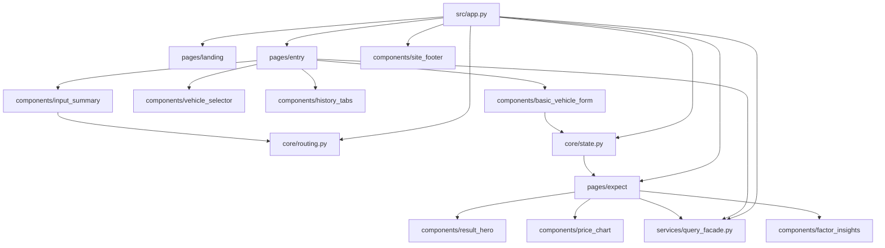
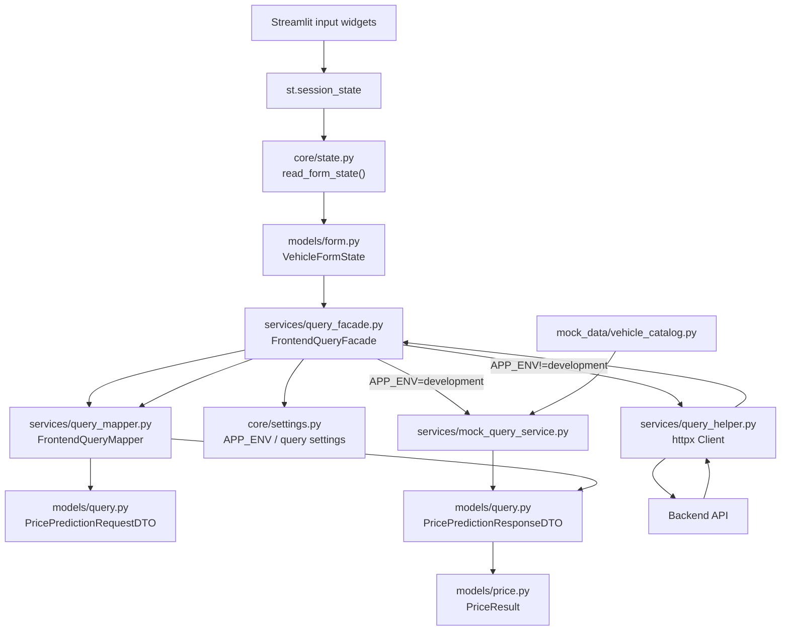

# FE

## 역할

`fe`는 이 모노레포의 Streamlit 프런트엔드입니다. 백엔드와 모델 호스팅 API를 연결하는 화면 레이어가 됩니다.

## 디렉토리 구성

- `pyproject.toml`: 프로젝트 메타데이터와 의존성 정의
- `.env`: 로컬 실행과 Docker 런타임에서 함께 사용하는 환경변수 파일
- `Dockerfile`: 프런트엔드 컨테이너 이미지 정의
- `src/app.py`: 라우팅과 페이지 조합을 담당하는 Streamlit 엔트리포인트
- `src/core`: 라우팅, 환경설정, `st.session_state` 관리
- `src/models`: 폼 상태, 가격 결과, query DTO 같은 실제 데이터 구조
- `src/pages`: 페이지 단위 조합 레이어. 화면에 필요한 데이터를 모아 컴포넌트에 내려줌
- `src/components`: UI 블록 레이어. 가급적 전달받은 데이터만 렌더링
- `src/services`: facade, query helper, mapper, mock service 등 백엔드 연동 레이어
- `src/mock_data`: development 환경에서 facade가 사용하는 정적 시드 데이터
- `src/styles/theme.css`: 공통 Streamlit 테마 스타일

## 역할 분리 원칙

- `app.py`: 어떤 페이지를 렌더할지 결정
- `pages/*`: 한 페이지에서 필요한 상태 읽기, facade 호출, 컴포넌트 조합 담당
- `components/*`: 실제 Streamlit 위젯과 마크업 렌더 담당
- `core/state.py`: 사용자 입력을 `st.session_state`에 저장하고 `VehicleFormState`로 묶음
- `services/query_facade.py`: frontend -> backend 진입점 하나로 통합
- `services/query_mapper.py`: frontend 상태 <-> request payload <-> response DTO 변환 담당
- `models/*`: 각 레이어에서 공유하는 typed data model 정의

## 호출 흐름



## Query 흐름



## Python 버전

- 최소 Python 버전: `3.12`
- Docker 이미지 기준 Python 버전: `3.12`

## 의존성 및 역할

- `streamlit`: 프런트엔드 UI를 구성하고, 설정값과 상태를 시각적으로 확인하는 데 사용합니다.
- `pandas`: 차트용 시계열 데이터와 파생 결과 데이터를 구성합니다.
- `httpx`: facade 내부 query helper가 백엔드 API를 호출할 때 사용합니다.

`fe/ideas/designs ideas/requirements.txt`에 있던 디자인 프로토타입 의존성은 현재 `pyproject.toml`로 옮겨 관리합니다.
프런트엔드의 데이터 접근은 `src/services/query_facade.py`를 통해 단일 진입점으로 모으고, `APP_ENV=development`일 때는 mock payload를 DTO로 매핑해 사용합니다.

## 로컬 실행

`uv run`은 `.env` 파일 주입을 직접 지원하므로 별도 Makefile 없이 실행할 수 있습니다.

```bash
cd fe
uv run --env-file .env streamlit run src/app.py
```

## Docker 실행

저장소 루트에서 실행합니다.

```bash
docker compose up --build fe
```

## 환경변수 설명

- `APP_ENV`: 실행 환경 구분값입니다.
- `SERVICE_NAME`: UI에 표시할 서비스 이름입니다.
- `STREAMLIT_SERVER_ADDRESS`: Streamlit 바인드 주소입니다.
- `STREAMLIT_SERVER_PORT`: Streamlit 포트입니다.
- `STREAMLIT_SERVER_HEADLESS`: 헤드리스 실행 여부입니다.
- `STREAMLIT_BROWSER_GATHER_USAGE_STATS`: Streamlit 사용 통계 수집 여부입니다.
- `FE_QUERY_BASE_URL`: 비개발 환경에서 query helper가 붙을 백엔드 기본 URL입니다.
- `FE_QUERY_CATALOG_PATH`: 차량 카탈로그 조회 경로입니다.
- `FE_QUERY_PRICE_PATH`: 가격 예측 조회 경로입니다.
- `FE_QUERY_TIMEOUT_SECONDS`: httpx query timeout 초 단위 값입니다.
